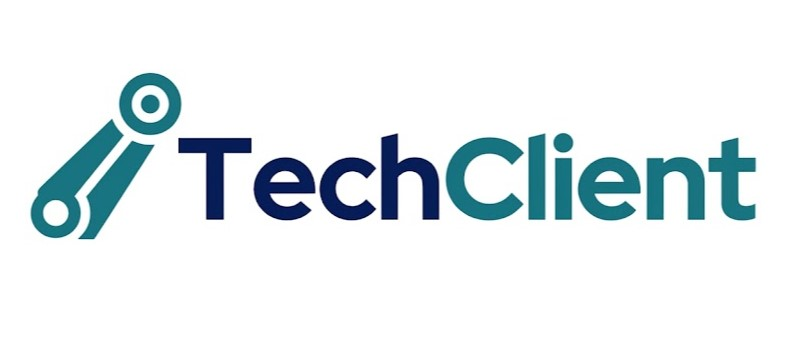

<h1 align="center">
  
</h1>

<p align="center">
  Sistema de atendimento inteligente com chatbot, NLP e IA generativa
</p>

<p align="center">
  
  
  
  
  
  
</p>

---

## 🎥 Demonstração

Assista à demonstração do projeto no YouTube:

[▶ Ver demonstração](https://youtube.com/shorts/k6h239-GYv4)

---

## 📌 Sobre o projeto

O **TechClient** é um sistema fullstack de suporte ao cliente com chatbot inteligente.
O bot utiliza **Dialogflow CX** para reconhecimento de intenções e **IA generativa (OpenAI)**
como fallback para perguntas não mapeadas, garantindo uma experiência conversacional fluida.

### Funcionalidades
- 💬 Chat em tempo real com bot inteligente
- 🎯 Reconhecimento de intenções via Dialogflow CX
- 🤖 Respostas generativas com GPT-4o-mini para perguntas abertas
- 🎫 Abertura e consulta de chamados via chat
- 📋 Histórico de conversas persistido no banco
- 🐳 Ambiente completo containerizado com Docker

---

## 🏗️ Arquitetura
<div align="center">
  
</div>

## 🚀 Como rodar localmente

### Pré-requisitos
- [Docker Desktop](https://www.docker.com/products/docker-desktop/)
- [Git](https://git-scm.com/)
- Conta no [Google Cloud](https://cloud.google.com/) com agente Dialogflow CX criado
- Chave de API da [OpenAI](https://platform.openai.com/)

### 1. Clone o repositório

```bash
git clone https://github.com/pabloquirino/techclient.git
cd techclient
```

### 2. Configure as variáveis de ambiente

```bash
cp .env.example .env
```

Edite o `.env` com suas credenciais:

```env
# Database
DB_NAME=TechClientDB
DB_PASSWORD=your_strong_password_here
DB_SERVER=techclient-db
DB_USER=sa

# API
ASPNETCORE_ENVIRONMENT=Production

# OpenAI
OpenAI__ApiKey=your_openai_key_here
OpenAI__Model=gpt-4.1-mini

# Dialogflow
DIALOGFLOW_PROJECT_ID=your_project_id
DIALOGFLOW_AGENT_ID=your_agent_id
DIALOGFLOW_LOCATION=us-central1

# GOOGLE
GOOGLE_APPLICATION_CREDENTIALS=/app/credentials/techclient-dialogflow.json
```

### 3. Adicione a credencial do Dialogflow

Coloque o arquivo JSON da Service Account do Google Cloud em:
backend/TechClient.API/credentials/techclient-dialogflow.json

### 4. Suba o ambiente

```bash
cd infra/docker
docker compose --env-file ../../.env -f docker-compose.prod.yml up --build 
```

### 5. Acesse a aplicação

| Serviço | URL |
|---|---|
| Frontend | http://localhost:80 |
| API / Swagger | http://localhost:8080/swagger |
| Banco de dados | localhost:1433 |

---

## 🤖 Como o chatbot funciona


### Intents mapeadas
| Intent | Exemplos |
|---|---|
| `intent.greeting` | "oi", "olá", "bom dia" |
| `intent.open-called` | "quero abrir um chamado", "preciso de suporte" |
| `intent.check-called` | "status do meu chamado", "protocolo TK-..." |
| `intent.faq-password` | "esqueci minha senha", "como resetar acesso" |
| `intent.human-agent` | "falar com atendente", "quero um humano" |
| `intent.goodbye` | "tchau", "obrigado", "encerrar" |

---

## 🛠️ Tecnologias

| Camada | Tecnologia |
|---|---|
| Frontend | Angular 19, TypeScript, SCSS |
| Backend | .NET 10, C#, Clean Architecture |
| Banco | SQL Server 2022, Entity Framework Core |
| NLP | Dialogflow CX |
| IA Generativa | OpenAI GPT-4o-mini |
| Containerização | Docker, Docker Compose |
| Versionamento | Git, GitHub, Conventional Commits |

---

## 📁 Estrutura do repositório
```bash
techclient/
├── frontend/
│   └── techclient-web/          # Projeto Angular
├── backend/
│   ├── TechClient.API/          # Controllers, middlewares
│   ├── TechClient.Application/  # Serviços, DTOs
│   ├── TechClient.Domain/       # Entidades, interfaces
│   └── TechClient.Infrastructure/ # EF Core, integrações
├── infra/
│   ├── docker/                  # docker-compose dev e prod
│   └── scripts/                 # Scripts utilitários
└── docs/                        # Documentação e diagramas
```
